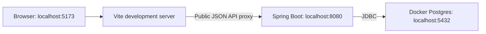

# raymoore.xyz — Project Plan

This document was generated by Codex using the `gpt-6-astra` model.

## Purpose and document status

Build a personal website as a monolithic web application in a monorepo. The first feature is **Madison SC**, an NFL pick'em league application for recording picks against the spread and viewing weekly results and cumulative standings. A shared, responsive hamburger navigation bar is also part of the initial website. Future features may include an arcade or blog.

This is a greenfield implementation plan for AI coding agents. It describes the intended application, not completed functionality. The database model and competition behavior below provide the starting domain requirements. Proposed API contracts and unresolved business rules are labeled explicitly.

Read `AGENTS.md` for collaboration guidance. The developer knows Java, Postgres, HTML, CSS, and JavaScript, but is learning Spring, React, and TypeScript. Explain unfamiliar framework concepts when introducing them, relate them to familiar concepts, and prefer conventional code with visible control flow. Avoid generic frameworks or abstractions created solely for hypothetical future features.

This file is the project's technical plan. [README.md](README.md) describes developer setup and day-to-day workflows. Keep both documents consistent as decisions are made.

### Initial scope and later work

- **Proof of concept:** public home and Madison SC pages, desktop/mobile hamburger navigation, five-pick administrator submissions using the `api-secret` HTTP header, Postgres persistence, and Flyway SQL migrations.
- **Manual administration:** Ray is the sole administrator. He creates contestants with SQL before submitting their picks, can backfill historical weeks at any time, and records or corrects results with SQL when needed. Do not build contestant-management or result-editing APIs/screens.
- **Later:** a Picks Submission page protected by Spring Security and Google OAuth 2.0 / OpenID Connect. JWT/session design is deferred and must not block the proof of concept.
- Do not add contestant self-service, multi-administrator coordination, submission deadlines, automatic grading, or edit workflows to the initial scope.

## Technology choices

| Area | Choice | Role |
| --- | --- | --- |
| Repository | `frontend/` and `backend/` | Separate build tools within one repository and application. |
| Backend | Java, Spring Boot, Spring MVC | HTTP endpoints, business rules, authentication, and database access. |
| Backend build | Maven with Maven Wrapper | Reproducible builds; standard Maven directory layout. |
| Persistence | Spring Data JDBC and `NamedParameterJdbcTemplate` | Repository operations and explicit SQL; no JPA or Hibernate. |
| Database | PostgreSQL 15.19; one database per environment | Use `raymoorexyz` as the local database name and match production's PostgreSQL 15 major version. Feature tables remain in `madisonsc`. |
| Schema changes | Flyway | Versioned `.sql` files, executed through Spring Boot. |
| Frontend | React and TypeScript | Browser UI composed of typed components. |
| Frontend tooling | Vite, Node.js, npm | Development server, dependency management, and static production build. |
| Initial API authentication | `api-secret` HTTP header, enforced on the backend | Only administrator submissions require the configured secret. Public reads require no login. |
| Future browser authentication | Spring Security, Google OAuth 2.0 / OpenID Connect | Protect a later administrator submission page; no JWT implementation in the proof of concept. |
| Local infrastructure | Docker Compose | Run Postgres locally while application processes run in the IDEs. |
| Production | Docker image deployed to Render via Docker Hub | One Spring Boot process serving the API and built frontend. |

Vite, npm, and serving the frontend from Spring Boot are the recommended defaults adopted by this plan. Production runs PostgreSQL 15.19 on aarch64; use PostgreSQL 15.19 for local development and database integration tests. Java, Spring Boot, Node, and frontend dependency versions must be selected and recorded when scaffolding. Use compatible stable releases, commit the Maven Wrapper and npm lockfile, and let Spring Boot manage compatible Spring dependency versions. Do not use dependency version ranges or an unpinned `latest` container tag for reproducible builds.

Google Cloud/GKE is a possible future deployment exercise. Microservices, server-side React rendering, and a separate production JavaScript application server are outside the initial scope.

## How the frontend and backend fit together

React components describe browser UI. TypeScript provides development-time type checking and is compiled into JavaScript. Spring controllers return JSON; React fetches that JSON and renders it. The browser never connects directly to Postgres.

### Local development



- Run Spring Boot in IntelliJ, with its embedded servlet server and a debugger.
- Run Vite in a VS Code terminal. It updates the frontend as source files change.
- Open the website at `http://localhost:5173`.
- Frontend requests use relative paths such as `/api/madisonsc/picks/13/1`.
- Configure Vite to proxy `/api` to Spring Boot. React owns the `/madisonsc` page: it requests the latest year/week from the JSON API, then requests and displays that weekly data. Local administrator POST requests go directly to `http://localhost:8080/madisonsc/picks/{year}/{week}` from an API client; the public React application never receives the API secret.
- Reserve `/oauth2`, `/login`, and `/logout` proxy configuration for the future Google-login feature.
- Keep the default browser traffic on one origin through the proxy. Do not solve ordinary local integration by allowing every CORS origin.
- Use a fixed Vite port (`strictPort: true`) so development URLs remain predictable.

Vite's [development proxy](https://vite.dev/config/server-options.html#server-proxy) forwards matching requests; it is development infrastructure, not backend business logic.

### Production

1. Build the frontend with npm/Vite to produce `frontend/dist/`.
2. Copy the contents into the backend's generated classpath resources under `static/` before packaging the executable JAR.
3. Package and run Spring Boot with its embedded servlet server, using one externally exposed application port.
4. Serve the UI and API from the same HTTPS origin; future login routes will use that origin too.

Use a root Dockerfile with separate frontend-build, backend-build, and Java-runtime stages. Arrange Maven resources so the frontend build enters the JAR; do not commit `dist/` or copy generated assets into tracked source directories. A normal backend-only development build should not require rebuilding the frontend.

React page URLs such as `/madisonsc` and `/madisonsc/picks/13/1` need an intentional Spring MVC fallback to `index.html` for browser navigation and refresh. Limit that fallback to GET/HEAD UI navigation; unknown `/api` routes and missing assets must retain appropriate errors. The same weekly path accepts administrator POST requests on Spring Boot, so never forward those requests to the SPA. The `/madisonsc` page then calls the latest-week JSON endpoint and navigates to the selected weekly view in the browser.

This combines [Vite's static build output](https://vite.dev/guide/build) with [Spring Boot's classpath static-resource support](https://docs.spring.io/spring-boot/reference/web/servlet.html). Node is a build/development dependency; the proposed production runtime is Java plus a separately hosted Postgres database.

## Intended repository structure

The following files and directories are a scaffold target, not a claim that they exist.

```text
raymoore-xyz/
├── frontend/
│   ├── package.json
│   ├── package-lock.json
│   ├── vite.config.ts
│   ├── tsconfig.json
│   ├── index.html
│   ├── public/                         # Assets served unchanged, e.g. team logos
│   └── src/
│       ├── main.tsx                    # Mount React in the HTML root element
│       ├── App.tsx                     # Application shell and routes
│       ├── pages/
│       │   ├── HomePage.tsx
│       │   └── madisonsc/              # MadisonScPage and WeeklyPicksPage
│       ├── components/
│       │   ├── layout/                 # SiteLayout, SiteNavigation
│       │   └── madisonsc/              # WeekNavigation, ContestantCard, PickCard
│       ├── api/                       # Shared fetch handling and typed API calls
│       ├── types/                     # API DTO types, team/result unions
│       ├── hooks/                     # Custom hooks when logic warrants reuse
│       └── styles/
├── backend/
│   ├── .mvn/wrapper/
│   ├── mvnw
│   ├── mvnw.cmd
│   ├── pom.xml
│   └── src/
│       ├── main/
│       │   ├── java/xyz/raymoore/
│       │   │   ├── RaymooreApplication.java
│       │   │   ├── config/
│       │   │   ├── auth/
│       │   │   └── madisonsc/
│       │   │       ├── controller/
│       │   │       ├── dto/
│       │   │       ├── service/
│       │   │       ├── domain/
│       │   │       └── repository/
│       │   └── resources/
│       │       ├── application.yml
│       │       ├── application-local.yml
│       │       └── db/migration/       # V1__create_madisonsc.sql, etc.
│       └── test/
│           ├── java/xyz/raymoore/
│           └── resources/
├── .env-template                   # Documented, nonsecret Compose variables
├── compose.yaml                    # Local Postgres service
└── Dockerfile                      # Production application image
```

Organize Java primarily by feature, then by responsibility. Keep the application class above feature packages so component scanning works conventionally. Add directories when used rather than generating empty layers.

## Backend conventions

### Responsibilities and Spring concepts

- **Controller:** translate HTTP paths and JSON into service calls; validate request DTOs and select response status codes. Use `@RestController` for JSON endpoints.
- **Service:** implement league rules and multi-step operations. Use `@Service` and constructor injection. Spring creates these objects and supplies their dependencies; do not manually instantiate repositories or keep mutable request data in singleton fields.
- **Repository:** read and write database data. Keep SQL and row mapping here, not in controllers.
- **DTO:** define the HTTP contract independently of persistence objects. Java records are a reasonable choice for immutable request/response shapes.
- **Configuration:** use normal Spring Boot properties, environment variables, and typed `@ConfigurationProperties` where appropriate. Do not create a parallel settings loader.

Keep rules such as standings calculation in small, testable Java methods. Prefer Spring MVC's normal blocking request model with JDBC; reactive APIs would add complexity without removing blocking database calls.

### Spring Data JDBC

- Use Spring Data JDBC repositories for straightforward CRUD and simple queries.
- Use `@Query` when explicit SQL is clearer than a derived query method.
- Use `NamedParameterJdbcTemplate` for complex joins, reporting queries, bulk operations, dynamic SQL, or other SQL-centric work.
- Keep mappings simple and explicit. Use Spring Data's `@Table`, `@Id`, and `@Column` to match Postgres names; do not use JPA annotations.
- Treat `Contestant` and `Pick` as separate aggregate roots. A pick references its contestant by UUID or `AggregateReference`; do not place every historical pick in a persistence-managed contestant collection.
- An aggregate is the group of records saved as one unit. Nested entity references imply ownership in Spring Data JDBC; they are not JPA-style lazy relationships. See [mapping and aggregate references](https://docs.spring.io/spring-data/relational/reference/jdbc/mapping.html).
- Use Spring-managed `@Transactional` on service operations that must succeed or fail together, such as a batch of weekly picks. Invoke these services through injected Spring beans; self-invocation does not establish a new proxy-based transaction boundary.
- Use the injected, Boot-managed datasource and JDBC helpers. Do not share mutable connections globally or manually commit inside a Spring-managed transaction.
- Prefer explicit, understandable SQL over forcing complex behavior into repository abstractions. Fetch weekly summaries in bounded queries, avoiding one contestant lookup per row.

Pay particular attention to IDs and defaults. A non-null, application-assigned UUID can make `save()` treat an object as existing. Choose and test a creation strategy; explicit inserts are appropriate when database-generated UUIDs or timestamps need `INSERT ... RETURNING`. Sending SQL `NULL` is not the same as omitting a column to use its default. See [entity persistence](https://docs.spring.io/spring-data/relational/reference/jdbc/entity-persistence.html). There is one administrator and no application edit workflow: do not add version columns, conflict-resolution screens, or custom concurrency infrastructure. Keep ordinary database constraints and atomic batch writes.

### Validation and error handling

- Apply Bean Validation to request DTOs, including nested pick entries; enforce cross-field and league rules in services.
- Return real response objects, not strings containing serialized JSON.
- Use consistent problem responses, preferably Spring `ProblemDetail` through centralized exception handling. Include field errors where useful, without SQL details or stack traces.
- Distinguish invalid input (`400`), missing authentication (`401`), denied permissions (`403`), missing resources (`404`), and duplicate/conflicting writes (`409`). API failures return JSON; login redirects are reserved for explicit login flows.
- Parameterize SQL values. Enforce uniqueness in the database even when prevalidation gives a friendlier message.
- Enforce the API secret and exactly-five-picks rule on the backend. Do not add time-based submission rejection: the administrator may backfill at any time.

## Madison SC domain and database

### Core model

Use lowercase `snake_case` for database identifiers, such as `pick_id`, `contestant_id`, and `entry_date`. Tables remain `madisonsc.contestant` and `madisonsc.pick`. This is the schema contract for both local development and production. Java properties may use normal `camelCase`; map them with Spring Data JDBC conventions or explicit `@Column` annotations as appropriate.

| Table | Column | Type and baseline constraints | Meaning |
| --- | --- | --- | --- |
| `madisonsc.contestant` | `contestant_id` | UUID primary key, database-generated default | Stable contestant identity. |
| | `entry_date` | `timestamptz NOT NULL DEFAULT now()` | Creation time. |
| | `name` | `text NOT NULL UNIQUE` | Display name. |
| `madisonsc.pick` | `pick_id` | UUID primary key, database-generated default | Stable pick identity. |
| | `entry_date` | `timestamptz NOT NULL DEFAULT now()` | Creation time. |
| | `contestant_id` | UUID, required foreign key to contestant | Pick owner. |
| | `year` | `int NOT NULL` | Competition year identifier. |
| | `week` | `int NOT NULL` | Week within that competition year. |
| | `team` | `text NOT NULL` | Team code, e.g. `GB`, `CHI`, `JAC`. |
| | `underdog` | Nullable boolean | Positive-spread indicator; NULL is valid for a zero-line PK pick. |
| | `line` | `numeric(3,1) NOT NULL` | Spread magnitude. |
| | `result` | Nullable text | `win`, `loss`, `tie`; null means pending. |

The UUID default in the reference schema uses `uuid_generate_v4()` from `uuid-ossp`. Initial SQL must establish that extension if retaining the expression; a different UUID-generation choice must be explicit.

Database invariants and mapping rules:

- A contestant has many picks across years and weeks. Keep the unique key `(contestant_id, year, week, team)`.
- Baseline secondary indexes cover contestant name and pick contestant/year/week/team/result. Review indexes against actual queries; the name uniqueness constraint already creates an index, and redundant indexes are unnecessary.
- Map UUIDs to Java `UUID`, timestamps to `Instant`, and `numeric(3,1)` to `BigDecimal`. Validate nonnegative magnitude, at most one decimal place, and a maximum of `99.9`.
- Store `GB +3.5` as `team = GB`, `underdog = true`, `line = 3.5`; a negative spread uses `underdog = false`. Display zero as `PK`.
- Use explicit team and result values. If Java enums use uppercase names, supply converters for lowercase stored results. Validate unknown values instead of interpreting them as pending.
- A zero line is a PK (Pick Em) game. Its `underdog` value may be NULL or false; direction is irrelevant because the UI always displays `PK` without a sign when `line = 0`. Check the line before the direction. Preserve the nullable SQL column and map it to Java `Boolean`; new PK submissions may consistently write false. A nonzero line requires a known direction; handle a malformed existing row explicitly rather than inventing a sign. No nullability change or data rewrite is needed.
- “Name normalization” means rules such as trimming spaces or treating `Ray` and `ray` as equivalent. Keep the existing case-insensitive contestant-name lookup for submissions and preserve the stored display name. The SQL uniqueness constraint is case-sensitive, so the administrator should avoid names differing only by case. Reject an ambiguous lookup with `409` instead of selecting an arbitrary row; a new normalization system or schema change is not required.
- A contestant must exist before a pick can reference its UUID. Ray creates contestants by manual SQL insert; the API never creates them implicitly. Contestants do not need Google accounts or a user-to-contestant association for this administrator-managed workflow.

There are no required matchup, schedule, or team tables in the initial model. Each pick contains its own spread and manually recorded outcome. Automated NFL score ingestion is outside the initial scope. Add tables only when a concrete feature needs them.

### Competition years and reference page

`year` is the year of the competition, not a calendar year. Year 13 is the **2026–2027 NFL season**, and Year 11 is the **2024–2025 NFL season**. Use these labels consistently in navigation and page headings; keep the competition number in URLs and database rows. With continuous annual numbering, the display mapping is season start year = competition year + 2013. Do not use that mapping to infer the active week or reject historical submissions.

The live [Year 11, Week 18 page](https://raymoore.xyz/madisonsc/picks/11/18) is a content reference: it displays week links 1–18, five picks per contestant, team logos, spreads, results, and weekly/cumulative records. Retain that information in the React design; the new shared navigation and numeric ranks are additional UI requirements.

### Weekly views and ranking

Confirmed rules:

- Each contestant submits **exactly five picks per week**, with distinct teams as required by the unique key. A missing submission remains empty; do not manufacture picks or losses.
- Show picks and a win-loss-tie record for the selected week, plus a cumulative record through that week.
- Rank the weekly view by **cumulative win percentage through the selected week**, highest first. Pending results do not count as completed wins, losses, or ties in the displayed records.
- Later weeks must not contribute to an earlier week's record or ranking.
- The administrator may submit/backfill any competition year and week at any time. Validate positive competition years and weeks 1–18, not calendar deadlines.
- A contestant with any picks in the selected competition year appears in its standings. Such a contestant can have an empty selected week, displayed as “No picks found.” A globally existing contestant with no picks that year need not appear; no season-roster table is needed for the initial application.
- Identical W-L-T records share the same rank. Alphabetical contestant name is a display ordering, not a competitive tiebreaker. Use UUID only as a final stable display key.

Define the exact win-percentage calculation when implementing the source code, including tie treatment, pending results, a zero-game record, and precision. This plan deliberately does not prescribe a formula or point system. One confirmed ordering example is that a cumulative `1-1-3` record ranks above `2-3-0`. Preserve that example as an acceptance case when selecting the calculation.

Recommended rank display is competition ranking (`1, 2, 2, 4`), with tied contestants sharing a number and the following number skipping the tied positions. Keep rank calculation separate from alphabetical display ordering; do not introduce a competitive name-based tiebreaker.

### Administrator workflow

1. Ray inserts a contestant into `madisonsc.contestant` using SQL, before submitting picks for that name.
2. Ray sends a five-pick batch to the secret-protected POST endpoint. It may include initial results for historical backfills or leave results pending.
3. Subsequent result entry/corrections and other data corrections are manual SQL operations. There is no result-update API or UI in the proof of concept.
4. Public readers view the updated data on the next fetch/reload. Live push updates are unnecessary.

Keep contestant data and operational pick/result changes separate from Flyway schema migrations. Manual administration does not imply bypassing foreign keys, uniqueness, or atomic insertion checks in the application.

## HTTP API and browser routes

Retain the existing administrator submission path, header, and shorthand body for the proof of concept. Add a public JSON read API for React. The table describes the target Spring application; these endpoints are not yet implemented in this repository.

| Method | Path | Purpose / intended access |
| --- | --- | --- |
| GET | `/` | React home page with the agreed greeting and work-in-progress message. |
| GET | `/madisonsc` | React landing page. It asks the public API for the latest year/week and displays that week's data, or an explicit empty state. |
| GET | `/api/madisonsc/latest` | Public latest-week lookup, returning the maximum `year`/`week` with pick entries or an empty result. |
| GET | `/madisonsc/picks/{year}/{week}` | React weekly view. |
| GET | `/api/madisonsc/picks/{year}/{week}` | Public weekly view data, including cumulative standings. |
| POST | `/madisonsc/picks/{year}/{week}` | Administrator-only five-pick submission using `api-secret`; JSON response. |

GET and POST intentionally use the same weekly path for different purposes. Restrict the SPA fallback by HTTP method, and ensure the secret check matches the POST route even though it is outside `/api`. There are no contestant CRUD, result PATCH, or `/api/auth/me` endpoints in the initial scope.

### Madison SC landing page

`GET /api/madisonsc/latest` runs this query against the singular table `madisonsc.pick`:

```sql
SELECT year, week
FROM madisonsc.pick
ORDER BY year DESC, week DESC
LIMIT 1;
```

Return JSON containing the selected `year` and `week`, or an explicit empty result when no picks exist. The maximum competition year/week determines the selected week, not the newest insertion timestamp, current calendar date, or whether results are complete. Backfilling an older week must not move the selected week backward. The React `/madisonsc` page uses this response to request `/api/madisonsc/picks/{year}/{week}` and render the weekly view; an empty result renders a clear “No picks available” state with the shared navigation. A dashboard or season-selection landing page may be added later.

Submission body (five distinct teams; fictional example):

```json
{
  "contestant": "Example Contestant",
  "picks": [
    "GB +3.5 W",
    "CHI -2.5 L",
    "DET PK T",
    "BUF -7",
    "KC +1.5"
  ]
}
```

Each shorthand entry contains a team code, a signed spread or `PK`, and an optional `W`, `L`, or `T`. Missing result means pending. Parse the format deliberately: reject unknown teams/results, missing signs on non-`PK` spreads, invalid decimals, extra tokens, and duplicate teams with a useful validation error. Keep the request contract; use typed values inside the service and persistence layers. A structured request DTO for a future UI is deferred.

Insert all five picks atomically and return HTTP `200` with a JSON object `{ "success": true }`. Validate the contestant exists, require exactly five entries, and reject a contestant/year/week that already contains picks with `409` rather than appending a sixth pick or silently replacing data. One invalid entry must leave the batch unsaved. The unique key alone prevents duplicate teams, not more than five different teams, so check both request size and existing weekly picks. Historical partial data requires manual reconciliation before submitting a full batch; there is no partial-fill endpoint. Missing/invalid secrets should return `401`; document that conventional error status even though the existing service uses `400` for an invalid secret.

The proposed weekly response includes `year`, `week`, season label, and ordered contestant summaries containing ID, name, rank, cumulative win percentage, cumulative record, weekly record, and that week's picks. Return records as numeric fields (`wins`, `losses`, `ties`) rather than only formatted strings. Calculate standings in Java/SQL; React formats and displays them. Specify the percentage representation and no-results value with the calculation during implementation, then define DTOs and representative response examples.

## Authentication and authorization

### Proof of concept: API secret

- Retain the `api-secret` HTTP header. It is a shared secret compared with backend configuration; it is **not a JWT** and does not require a token issuer, refresh flow, or Google account.
- Bind `APP_API_SECRET` to a backend property such as `app.api-secret`. Never commit a real secret, log the header, embed it in the frontend, or expose it through a public endpoint.
- Authenticate every administrator submission on the backend before processing the body. Missing/invalid credentials cannot write. If the configured secret is absent or blank, fail closed for writes while allowing public reads.
- Spring Security can enforce this through a small authentication filter scoped to the exact POST route. Do not turn secret validation into scattered controller logic or introduce an OAuth/JWT server for it.
- The API client explicitly supplies the header; the proof of concept has no browser-carried authentication cookie. If Spring Security is installed, scope any CSRF exemption to that header-only submission operation. Do not disable future browser-login CSRF protection globally. See [Spring Security's CSRF guidance](https://docs.spring.io/spring-security/reference/servlet/exploits/csrf.html).
- Use HTTPS for the deployed API. Local examples use HTTP only on localhost. Ray is the sole administrator; multiple roles, contestant accounts, and concurrent-edit infrastructure are unnecessary.

The `local` profile uses the same secret-header contract as production. Public read development does not require a secret; submission development requires `APP_API_SECRET`. No implicit local administrator bypass is needed.

### Later: Google-protected Picks Submission page

Use **Spring Security** for “Spring Auth,” with Google as the only OAuth 2.0 / OpenID Connect identity provider. Authorize Ray's configured identity on the backend; a successful Google login must not grant every user write access. See [Spring Security's Google login configuration](https://docs.spring.io/spring-security/reference/servlet/oauth2/login/core.html).

At that phase, choose the browser authentication design together: server session or application JWT, credential storage/transport, expiration, CSRF handling, and logout. The original JWT idea is deferred, not something to retrofit onto the secret header. Google login does not require inventing a JWT issuer. Never put the administrator's shared secret in the Picks Submission page. Decide whether to retain the separate secret-authenticated API for administrative tools when the browser flow is introduced.

## Database change workflow

Flyway is the selected runner. Keep production SQL in `backend/src/main/resources/db/migration/`, using filenames such as `V1__create_madisonsc.sql` and, for a subsequent agreed change, `V2__add_pick_validation_constraints.sql`. Spring Boot runs pending scripts at startup. Include the Flyway integration and Postgres-specific Flyway module appropriate to the selected Boot version. Use Flyway as the sole schema-initialization mechanism. Identity tables are deferred until browser authentication needs them. See [Spring Boot database initialization](https://docs.spring.io/spring-boot/how-to/data-initialization.html).

- Write idempotent SQL: use `CREATE EXTENSION IF NOT EXISTS`, `CREATE SCHEMA IF NOT EXISTS`, `CREATE TABLE IF NOT EXISTS`, and `CREATE INDEX IF NOT EXISTS` where appropriate. For later alterations, check the relevant catalog/definition before applying a change when Postgres provides no suitable `IF NOT EXISTS` form.
- Initial SQL creates the schema on an empty local database and leaves matching existing production application objects and data unchanged. Use consistent existing object names so the initial script does not create duplicate indexes under new names. Flyway itself still creates and maintains its history metadata.
- `CREATE TABLE IF NOT EXISTS` only checks existence; it does not verify or repair an existing table's structure. Validate schema compatibility separately and make deliberate future changes in new migrations. See [Postgres CREATE TABLE semantics](https://www.postgresql.org/docs/current/sql-createtable.html).
- Applied versioned scripts are immutable; add a higher-numbered script for a change.
- Flyway records versions and checksums in its schema-history table. Do not edit that table or use repair to hide an unexplained mismatch.
- Keep the history table in `public` and configure Flyway's managed schemas as `public,madisonsc`, while application SQL remains schema-qualified. This makes existing `madisonsc` objects part of Flyway's empty/nonempty schema check.
- Flyway connects to an existing database; Compose or the database administrator creates the database and grants required permissions.
- Keep sample contestants/picks in an explicit local fixture script or test resources, not unconditional production migrations.
- Test both empty-database initialization and first Flyway attachment to an existing matching schema without Flyway history, using isolated databases. Check that application data and schema definitions are preserved. Also test each new change against the prior schema. Idempotent SQL does not mean previously applied Flyway versions rerun at every startup.

These conventions follow [Flyway's versioned SQL workflow](https://documentation.red-gate.com/flyway/flyway-concepts/migrations/versioned-migrations). No custom migration runner is needed.

### First attachment to the existing production database

Idempotent statements address SQL execution, but Flyway also needs to adopt a nonempty schema without its history table. For the first attachment, set `spring.flyway.baseline-on-migrate=true` and explicitly set `spring.flyway.baseline-version=0`. That records a starting baseline below `V1`, so the idempotent `V1` still executes. The usual baseline version of `1` would skip `V1`. Subsequent starts use the history table; automatic baselining can then be disabled. Fresh local databases do not require a baseline. See [Flyway baseline-on-migrate](https://documentation.red-gate.com/flyway/reference/configuration/flyway-namespace/flyway-baseline-on-migrate-setting).

Configure this for the intended application database after verifying its schema; these documents do not perform a production connection or baseline operation. Future migrations may intentionally change production objects, so the no-op expectation applies to initial creation of objects that already match, not all future schema changes.

## React and TypeScript conventions

- Use functional components, hooks, and strict TypeScript. A component is a UI function; props are its inputs, while state holds values that change during interaction.
- `pages/` contains route-level views. `components/` contains reusable UI pieces. These are project conventions, not React-required folder names.
- Start with a normal Vite React/TypeScript SPA and a small client router. Define routes for `/`, `/madisonsc`, and `/madisonsc/picks/:year/:week`; keep routing and API fetching explicit, and add broader state/query libraries only when their benefit is clear.
- Keep state close to its owner and lift it to a common parent when siblings must coordinate. Derive display values instead of storing redundant state. See [Thinking in React](https://react.dev/learn/thinking-in-react).
- Put HTTP calls in `src/api/`; check non-success responses and handle loading, error, empty, and success states. Cancel or ignore stale requests when the selected year/week changes.
- Keep server DTOs and frontend types aligned. TypeScript types do not validate incoming JSON at runtime; validate at external boundaries when needed. Avoid `any` and broad type assertions that hide contract mismatches.
- Run a TypeScript check in addition to the Vite build: Vite transpiles TypeScript but does not itself type-check it. See [Vite's TypeScript behavior](https://vite.dev/guide/features.html#typescript).
- Use controlled inputs for pick forms, immutable state updates, stable database IDs as list keys, and effects for external synchronization rather than ordinary derived calculations.
- Begin with readable CSS and semantic HTML. Provide labels, keyboard navigation, visible focus, responsive layout, and textual result labels alongside colors.
- Keep credentials and SQL out of frontend code. Vite-exposed environment values are public build inputs, not a secret store.

Suggested weekly components are `WeeklyPicksPage`, `WeekNavigation`, `ContestantCard`, `RecordSummary`, and `PickCard`. Add a Picks Submission page only in the later Google-login phase; result-entry and contestant-management pages are outside scope. Consult [React with TypeScript](https://react.dev/learn/typescript) when introducing typed props and hooks.

### Shared hamburger navigation

- Build `SiteLayout` and `SiteNavigation` once and use them on the home, Madison SC landing, weekly, and empty-state views.
- Provide a clearly labeled hamburger button on both desktop and mobile. It opens a simple, nonmodal navigation panel containing normal links; start with Home (`/`) and Madison SC (`/madisonsc`). Add links for future features when they exist.
- Use a semantic `<nav>` and a real `<button>` with an accessible name, `aria-expanded`, and `aria-controls`. A collection of website links does not need application-style `role="menu"` keyboard behavior.
- Support keyboard activation, Tab navigation, visible focus, Escape to close and return focus to the button, and closing on route selection. Hide closed-panel links from keyboard navigation. Keep touch targets usable and prevent horizontal overflow on small screens.
- Indicate the current section with text/styling and `aria-current` where appropriate. Keep week navigation separate from the global menu, with the selected week clearly marked.
- The Madison SC link points to `/madisonsc`. React renders that page, calls the latest-week API, and then loads the selected weekly data. A normal link is appropriate for the global navigation and also works on a direct browser visit.
- Keep historical year/week navigation on the weekly view. `/madisonsc` itself selects the newest year/week with pick entries through the API; a separate selection dashboard is deferred.
- Keep historical links such as `/madisonsc/picks/11/18` directly navigable and refreshable. Initial UI acceptance includes narrow mobile and desktop viewports, public empty states, and menu keyboard operation.

### Initial home page

At `/`, render the shared navigation and this simple content:

```html
<h1>Hello, world!</h1>
<p>This site is a constant work in progress...</p>
```

Keep this in `HomePage.tsx`; a personal profile, project dashboard, and richer home-page content are later work.

## Verification and delivery

- Use JUnit for cumulative win-percentage ranking once its calculation is specified, including `1-1-3` ranking above `2-3-0`, identical records sharing rank, historical week cutoffs, and pending/no-results cases. Also cover competition-year labels, exactly five picks, distinct teams, and shorthand validation.
- Use real Postgres integration tests, preferably Testcontainers, for SQL mappings, defaults, enum conversion, uniqueness, and transaction rollback. Avoid substituting H2 for Postgres-specific behavior.
- Cover idempotent schema initialization, baseline-at-zero adoption of an existing schema, and `snake_case` column mappings. Cover PK rendering with both NULL and false directions.
- Test administrator POST requests with valid, missing, invalid, and unconfigured secrets. Verify one invalid pick cannot leave a partially inserted batch, an existing week cannot receive five more picks, and historical backfill remains allowed. Google-login tests belong to the later phase.
- Use Vitest and React Testing Library for meaningful UI behavior, particularly request failures, empty weeks, shared rank display, and hamburger menu keyboard/navigation behavior. Test user-visible behavior rather than internal component details.
- Establish Maven `verify` and frontend lint/type-check/test/build commands in CI. Tests needing Docker must be documented.
- Verify production packaging by opening a nested UI route directly, fetching JSON from `/api`, and confirming unknown API paths are not answered with HTML.
- Verify `/madisonsc` loads through both Vite and the packaged app, requests the latest year/week through the API, renders the selected weekly data, and handles an empty database. Use test fixtures with different insertion and competition-year/week orderings; the selected week must remain data-driven as new picks arrive.
- Inject deployment configuration at runtime; use an externally configured port and database credentials. Keep local database volumes out of application images.

## Remaining decisions

- Define the win-percentage calculation during source implementation. The ranking criterion and the `1-1-3` above `2-3-0` example are settled; do not substitute a points-based approximation.
- Choose and pin compatible Java, Spring Boot, Node, and frontend dependency versions during scaffolding. PostgreSQL 15.19 is already selected. The implementation must match the setup examples and document tested versions.
- In the later Google-login phase, choose the browser credential/session design and configure Ray's administrator identity. This does not block secret-authenticated submissions.

Competition-year meaning, ranking by cumulative win percentage, five picks per week, administrator-managed submissions, unrestricted historical backfill, manual contestant/result maintenance, PK direction handling, use of the existing production database, idempotent SQL, API-driven latest-week selection, and the greeting home page are settled requirements. Do not reopen them or add management interfaces as prerequisites to the proof of concept.
