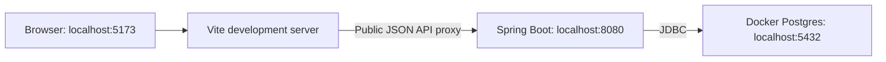

# raymoore.xyz — Project Plan

This document was generated by Codex using the `gpt-6-astra` model.

## Purpose and document status

Build a personal website as a monolithic web application in a monorepo. The first project is [Madison SC](.projects/madisonsc/README.md), an NFL pick'em league tracker. A shared, responsive hamburger navigation bar is also part of the initial website. Future features may include an arcade or blog.

This is the implementation plan for AI coding agents. The foundation is implemented: Java 25, Spring Boot 4.1.1 with MVC, Maven Wrapper 3.9.11, local PostgreSQL 15.19 through Compose, Flyway V1, Spring Data JDBC `Contestant` and `Pick` records, public contestant/latest-week/weekly-picks APIs, and secret-protected administrator pick submission. The React/TypeScript frontend uses Vite, React Router, a responsive slide-out navigation drawer, a global home page, and Madison SC latest-week and weekly standings views. Further features remain planned. It defines shared technologies, architecture, and authentication for the personal website. Project-specific business requirements and data models live in `.projects/<project>/README.md`. Proposed API contracts and unresolved business rules are labeled explicitly.

Read `AGENTS.md` for collaboration guidance. The developer knows Java, Postgres, HTML, CSS, and JavaScript, but is learning Spring, React, and TypeScript. Explain unfamiliar framework concepts when introducing them, relate them to familiar concepts, and prefer conventional code with visible control flow. Avoid generic frameworks or abstractions created solely for hypothetical future features.

This file is the shared technical plan. The [Madison SC plan](.projects/madisonsc/README.md) owns its league rules, contestant/pick schema, API contracts, and UI requirements. [README.md](README.md) describes developer setup and day-to-day workflows. Keep these documents consistent as decisions are made.

### Initial scope and later work

- **Proof of concept:** public home page, shared desktop/mobile hamburger navigation, the Madison SC project, administrator API writes using the `api-secret` HTTP header, Postgres persistence, and Flyway SQL migrations.
- **Administration:** Ray is the sole administrator. Public reads require no login; project plans define their administrative workflows.
- **Later:** browser administration protected by Spring Security and Google OAuth 2.0 / OpenID Connect. JWT/session design is deferred and must not block the proof of concept.
- Future projects, such as an arcade or blog, share this application and have their own plans under `.projects/`.

## Technology choices

| Area | Choice | Role |
| --- | --- | --- |
| Repository | `frontend/` and `backend/` | Separate build tools within one repository and application. |
| Backend | Java, Spring Boot, Spring MVC | HTTP endpoints, business rules, authentication, and database access. |
| Backend build | Maven with Maven Wrapper | Reproducible builds; standard Maven directory layout. |
| Persistence | Spring Data JDBC and `NamedParameterJdbcTemplate` | Repository operations and explicit SQL; no JPA or Hibernate. |
| Database | PostgreSQL 15.19; one database per environment | Use the `raymoorexyz` database with a separate schema for each project; match production's PostgreSQL 15 major version. |
| Schema changes | Flyway | Versioned `.sql` files, executed through Spring Boot. |
| Frontend | React and TypeScript | Browser UI composed of typed components. |
| Frontend tooling | Vite, Node.js, npm | Development server, dependency management, and static production build. |
| Initial API authentication | `api-secret` HTTP header, enforced on the backend | Only administrator submissions require the configured secret. Public reads require no login. |
| Future browser authentication | Spring Security, Google OAuth 2.0 / OpenID Connect | Protect later browser administration; no JWT implementation in the proof of concept. |
| Local infrastructure | Docker Compose | Run Postgres locally while application processes run in the IDEs. |
| Production | Docker image deployed to Render via Docker Hub | One Spring Boot process serving the API and built frontend. |

Vite, npm, and serving the frontend from Spring Boot are the recommended defaults adopted by this plan. Production runs PostgreSQL 15.19 on aarch64; use PostgreSQL 15.19 for local development and database integration tests. The backend pins Java 25, Spring Boot 4.1.1, and Maven 3.9.11 (Wrapper 3.3.4). The frontend uses Node 24.20.0 (`frontend/.nvmrc`), with exact dependency versions in `frontend/package.json` and the committed `frontend/package-lock.json`. Use compatible stable releases, commit the Maven Wrapper and npm lockfile, and let Spring Boot manage compatible Spring dependency versions. Do not use dependency version ranges or an unpinned `latest` container tag for reproducible builds.

Google Cloud/GKE is a possible future deployment exercise. Microservices, server-side React rendering, and a separate production JavaScript application server are outside the initial scope.

## How the frontend and backend fit together

React components describe browser UI. TypeScript provides development-time type checking and is compiled into JavaScript. Spring controllers return JSON; React fetches that JSON and renders it. The browser never connects directly to Postgres.

### Local development



- Run Spring Boot in IntelliJ, with its embedded servlet server and a debugger.
- Run Vite in a VS Code terminal. It updates the frontend as source files change.
- Open the website at `http://localhost:5173`.
- Frontend JSON requests use relative paths under `/api`. Project plans define their concrete routes.
- Configure Vite's development and preview servers to proxy `/api` to Spring Boot. React owns page rendering and fetches data from the JSON API. Local secret-authenticated administrator requests go directly to Spring Boot at `http://localhost:8080` from an API client; the public React application never receives the API secret.
- Reserve `/auth` proxy configuration for the future Google-login feature. Forward these paths unchanged to Spring Boot; all site authentication routes will live under this prefix.
- Keep the default browser traffic on one origin through the proxy. Do not solve ordinary local integration by allowing every CORS origin.
- Use a fixed Vite port (`strictPort: true`) so development URLs remain predictable.

Vite's [development proxy](https://vite.dev/config/server-options.html#server-proxy) forwards matching requests; it is development infrastructure, not backend business logic.

### Production

1. From `frontend/`, run `npm ci`, then `npm run build` to produce `frontend/dist/`.
2. Copy the contents into the backend's generated classpath resources under `static/` before packaging the executable JAR.
3. Package and run Spring Boot with its embedded servlet server, using one externally exposed application port.
4. Serve the UI and API from the same HTTPS origin; future login routes will use that origin too.

Use a root Dockerfile with separate frontend-build, backend-build, and Java-runtime stages. Arrange Maven resources so the frontend build enters the JAR; do not commit `dist/` or copy generated assets into tracked source directories. A normal backend-only development build should not require rebuilding the frontend.

React page URLs need an intentional Spring MVC fallback to `index.html` for browser navigation and refresh. Limit that fallback to GET/HEAD UI navigation; unknown `/api` routes and missing assets must retain appropriate errors. Never forward write requests to the SPA. Project plans define page routes and any method-specific overlap with backend endpoints.

This combines [Vite's static build output](https://vite.dev/guide/build) with [Spring Boot's classpath static-resource support](https://docs.spring.io/spring-boot/reference/web/servlet.html). Node and npm are build/development dependencies used locally and in CI/image builds; the proposed production runtime is Java plus a separately hosted Postgres database.

## Intended repository structure

The application files and directories below are a scaffold target; the planning documents already exist.

```text
raymoore-xyz/
├── PROJECT.md                      # Shared personal-site architecture and strategy
├── .projects/
│   └── madisonsc/
│       └── README.md               # Madison SC requirements and data model
├── frontend/
│   ├── package.json
│   ├── package-lock.json
│   ├── vite.config.ts
│   ├── tsconfig.json
│   ├── index.html
│   ├── public/                         # Assets served unchanged
│   └── src/
│       ├── main.tsx                    # Mount React in the HTML root element
│       ├── App.tsx                     # Top-level component and route selection
│       ├── app/                        # Application-wide shell and shared UI
│       │   ├── pages/                  # Shared route-level views
│       │   │   └── HomePage.tsx        # Global home page
│       │   ├── components/             # Shared UI pieces
│       │   │   └── layout/             # SiteLayout, SiteNavigation
│       │   └── styles.css              # Shared application styles
│       └── projects/                   # Project-specific frontend code
│           └── <project>/              # e.g. madisonsc, blog
│           │   ├── pages/              # Project route-level views
│           │   ├── components/         # Project-specific UI pieces
│           │   ├── api/                # Project API calls
│           │   ├── types/              # Project API types
│           │   └── styles.css           # Project-specific styles
├── backend/
│   ├── .mvn/wrapper/
│   ├── mvnw
│   ├── mvnw.cmd
│   ├── pom.xml
│   └── src/
│       ├── main/
│       │   ├── java/xyz/raymoore/
│       │   │   ├── App.java
│       │   │   ├── config/
│       │   │   ├── auth/
│       │   │   └── <project>/
│       │   │       ├── controller/
│       │   │       ├── service/
│       │   │       ├── domain/               # Database-mapped records
│       │   │       ├── dto/                  # API request/response objects
│       │   │       └── repository/           # Spring Data JDBC repositories
│       │   └── resources/
│       │       ├── application.yml
│       │       ├── application-local.yml
│       │       └── db/migration/       # Versioned SQL across project schemas
│       └── test/
│           ├── java/xyz/raymoore/
│           └── resources/
├── .env                            # Local configuration, ignored by Git; example in README.md
├── compose.yaml                    # Local Postgres service
└── Dockerfile                      # Production application image
```

Organize Java primarily by feature, then by responsibility. All subprojects must place database-mapped domain objects in `xyz.raymoore.<project>.domain`, repositories in `xyz.raymoore.<project>.repository`, and HTTP request/response DTOs in `xyz.raymoore.<project>.dto`. AI coding agents must follow this convention for existing and future subprojects. Madison SC currently has `Contestant` and `Pick` in `domain`, and `ContestantRepository` and `PickRepository` in `repository`. Name the Spring Boot main class `App` and place it in `backend/src/main/java/xyz/raymoore/App.java` (fully qualified name `xyz.raymoore.App`). Keep it above feature packages so component scanning works conventionally. Add directories when used rather than generating empty layers.

## Backend conventions

### Responsibilities and Spring concepts

- **Controller:** translate HTTP paths and JSON into service calls; validate request DTOs and select response status codes. Use `@RestController` for JSON endpoints.
- **Service:** implement business rules and multi-step operations. Use `@Service` and constructor injection. Spring creates these objects and supplies their dependencies; do not manually instantiate repositories or keep mutable request data in singleton fields.
- **Repository:** read and write database data. Place repository interfaces and database access code in `xyz.raymoore.<project>.repository`. Keep SQL and row mapping here, not in controllers.
- **Domain objects:** AI coding agents must place database-mapped records such as `Contestant` and `Pick` in `xyz.raymoore.<project>.domain`. For existing and future subprojects, follow these records as the implementation pattern: immutable Java records with Spring Data JDBC mapping annotations and plain Java inner builders as described below. Annotate both the static `builder()` factory method and the nested `Builder` class with `@SuppressWarnings("unused")`. Keep the suppression on those two declarations rather than on the enclosing record or on each builder member. This covers intentionally unused builder APIs while retaining unused-code inspection elsewhere in the record. Repositories provide database access.
- **DTO:** define HTTP request/response contracts independently of persistence objects under `xyz.raymoore.<project>.dto`. Group contracts by operation rather than consumer or direction; for example, Madison SC uses `dto.query` for public read contracts and `dto.submission` for its administrator submission request and response. Avoid consumer-specific package names such as `dto.frontend` and broad direction-only groupings such as `dto.request` and `dto.response`. Java records are a reasonable choice for immutable DTOs.
- **Builders:** AI coding agents must add a nested `public static final class Builder` to each domain record and DTO, and a `public static Builder builder()` factory method on the enclosing type that returns `new Builder()`. The builder has private fields, a fluent method for each field returning `this`, and a public `build()` method that calls the enclosing type's constructor. For domain records, apply the two scoped `@SuppressWarnings("unused")` annotations specified above. This supports calls such as `Contestant.builder().contestantId(id).entryDate(now).name("Ray").build()`. Use plain Java; do not add Lombok. Preserve Spring Data JDBC mapping annotations on domain records; record loading continues to use the canonical constructor.
- **Configuration:** use normal Spring Boot properties, environment variables, and typed `@ConfigurationProperties` where appropriate. Do not create a parallel settings loader. Do not put inline defaults in environment-variable references such as Spring's `${NAME}` or Compose's `${NAME}` syntax. Declare required values explicitly so missing configuration fails fast; model genuinely optional configuration deliberately rather than hiding its absence behind a placeholder fallback.

Keep business rules in small, testable Java methods. Prefer Spring MVC's normal blocking request model with JDBC; reactive APIs would add complexity without removing blocking database calls.

### Spring Data JDBC

- Use Spring Data JDBC repositories for straightforward CRUD and simple queries.
- Use `@Query` when explicit SQL is clearer than a derived query method.
- Use `NamedParameterJdbcTemplate` for complex joins, reporting queries, bulk operations, dynamic SQL, or other SQL-centric work.
- Keep mappings simple and explicit. Use Spring Data's `@Table`, `@Id`, and `@Column` to match Postgres names; do not use JPA annotations.
- An aggregate is the group of records saved as one unit. Nested entity references imply ownership in Spring Data JDBC; they are not JPA-style lazy relationships. See [mapping and aggregate references](https://docs.spring.io/spring-data/relational/reference/jdbc/mapping.html).
- Use Spring-managed `@Transactional` on service operations that must succeed or fail together, such as an atomic batch write. Invoke these services through injected Spring beans; self-invocation does not establish a new proxy-based transaction boundary.
- Use the injected, Boot-managed datasource and JDBC helpers. Do not share mutable connections globally or manually commit inside a Spring-managed transaction.
- Prefer explicit, understandable SQL over forcing complex behavior into repository abstractions. Fetch related data in bounded queries, avoiding a separate lookup per row.

Pay particular attention to IDs and defaults. A non-null, application-assigned UUID can make `save()` treat an object as existing. Choose and test a creation strategy; explicit inserts are appropriate when database-generated UUIDs or timestamps need `INSERT ... RETURNING`. Sending SQL `NULL` is not the same as omitting a column to use its default. See [entity persistence](https://docs.spring.io/spring-data/relational/reference/jdbc/entity-persistence.html).

### Validation and error handling

- Apply Bean Validation to request DTOs, including nested entries; enforce cross-field and business rules in services.
- Return real response objects, not strings containing serialized JSON.
- Use consistent problem responses, preferably Spring `ProblemDetail` through centralized exception handling. Include field errors where useful, without SQL details or stack traces.
- Distinguish invalid input (`400`), missing authentication (`401`), denied permissions (`403`), missing resources (`404`), and duplicate/conflicting writes (`409`). API failures return JSON; login redirects are reserved for explicit login flows.
- Parameterize SQL values. Enforce uniqueness in the database even when prevalidation gives a friendlier message.
- Enforce authentication and project-specific write rules on the backend.

## Database schema organization

Use one `raymoorexyz` PostgreSQL database per environment. Each project gets its own schema within that database; for example, Madison SC owns `madisonsc`. Project tables, constraints, and domain mappings are documented in that project's plan, starting with the [Madison SC database model in the Madison SC README](.projects/madisonsc/README.md).

Use lowercase `snake_case` database identifiers and schema-qualified application SQL. Keep Flyway's shared history table in `public` and include each project schema in its managed schemas as projects are added.

UUID primary-key and foreign-key column names must end in `_id`, such as `pick_id` and `contestant_id`. Name ordinary single-column indexes `<table>_<column>`, preserving the full column name: the index on `madisonsc.pick(contestant_id)` is `pick_contestant_id`, and the index on `madisonsc.pick(year)` is `pick_year`. Do not collapse `_id` to `id` in index names or add an `idx_` prefix or `_idx` suffix. For new multicolumn indexes, use `<table>_<column1>_<column2>...` in indexed-column order; use a concise descriptive name if needed to avoid PostgreSQL's identifier-length limit. Preserve established names for existing composite indexes, including Madison SC's `pick_unique`. Constraint-backed indexes may retain PostgreSQL's generated names, such as `contestant_pkey` and `contestant_name_key`; do not create duplicate indexes for primary-key or unique constraints. These conventions apply to all subprojects.

Generate UUIDv4 IDs with PostgreSQL's built-in `pg_catalog.gen_random_uuid()` in column defaults. No UUID extension is required. See [PostgreSQL 15 UUID functions](https://www.postgresql.org/docs/15/functions-uuid.html).

This root plan will also describe schema requirements for shared personal-site features, such as authentication, when those features need persistent data. No shared identity tables or auth schema are defined yet.

## Authentication and authorization

### Proof of concept: API secret

- Retain the `api-secret` HTTP header. It is a shared secret compared with backend configuration; it is **not a JWT** and does not require a token issuer, refresh flow, or Google account.
- Bind `APP_API_SECRET` to a backend property such as `app.api-secret`. Never commit a real secret, log the header, embed it in the frontend, or expose it through a public endpoint.
- Authenticate every administrator submission on the backend before processing the body. Missing/invalid credentials cannot write. A missing `APP_API_SECRET` configuration prevents application startup; a configured but blank secret fails closed for writes.
- Spring Security can enforce this through a small authentication filter scoped to the protected administrator routes defined in project plans. Do not turn secret validation into scattered controller logic or introduce an OAuth/JWT server for it.
- The API client explicitly supplies the header; the proof of concept has no browser-carried authentication cookie. If Spring Security is installed, scope any CSRF exemption to the header-only administrator operations. Do not disable future browser-login CSRF protection globally. See [Spring Security's CSRF guidance](https://docs.spring.io/spring-security/reference/servlet/exploits/csrf.html).
- Use HTTPS for the deployed API. Local examples use HTTP only on localhost. Ray is the sole administrator; multiple roles and concurrent-edit infrastructure are unnecessary for the initial site.

The `local` profile uses the same secret-header contract as production. `APP_API_SECRET` must be present to start the application locally, but public read clients do not send it; only submission clients supply it through the `api-secret` header. No implicit local administrator bypass is needed.

### Later: Google-protected browser administration

Use **Spring Security** for “Spring Auth,” with Google as the only OAuth 2.0 / OpenID Connect identity provider. Authorize Ray's configured identity on the backend; a successful Google login must not grant every user write access. See [Spring Security's Google login configuration](https://docs.spring.io/spring-security/reference/servlet/oauth2/login/core.html).

Nest site authentication routes under `/auth`:

| Method | Path | Purpose |
| --- | --- | --- |
| GET | `/auth/login` | Backend entry point that starts Google login or displays a login failure. |
| GET | `/auth/oauth2/authorization/google` | Start Google login. |
| GET | `/auth/login/oauth2/code/google` | Receive Google's login callback. |
| POST | `/auth/logout` | Sign out of the website, with browser CSRF protection. |

Configure Spring Security's login page/entry point, authorization endpoint base URI, callback matcher, and logout URL to match these paths. Provide the `/auth/login` handler explicitly: redirect normal visits to the initiation route, but display failures at `/auth/login?error` without automatically retrying. Send successful logout to `/`. Spring's top-level paths are configurable defaults; see [OAuth2 endpoint customization](https://docs.spring.io/spring-security/reference/servlet/oauth2/login/advanced.html) and [logout configuration](https://docs.spring.io/spring-security/reference/servlet/authentication/logout.html).

Set the client registration's redirect URI to `{baseUrl}/auth/login/oauth2/code/{registrationId}` and register the matching full callback URLs for local development and production in Google Cloud. Google's [redirect URI requirements](https://developers.google.com/identity/protocols/oauth2/web-server#creatingcred) require an exact match. Use the browser-facing origin, including Vite's port locally. Route `/auth` to Spring Boot in both environments and exclude it from the React SPA fallback.

At that phase, choose the browser authentication design together: server session or application JWT, credential storage/transport, expiration, CSRF handling, and logout. The original JWT idea is deferred, not something to retrofit onto the secret header. Google login does not require inventing a JWT issuer. Never put the administrator's shared secret in browser administration pages. Decide whether to retain the separate secret-authenticated API for administrative tools when the browser flow is introduced.

## Database change workflow

Flyway is the selected runner. Keep production SQL in `backend/src/main/resources/db/migration/`, using versioned filenames in the form `V<number>__<description>.sql` and one shared version sequence across project schemas. Project plans identify their required migrations. Spring Boot runs pending scripts at startup. Include the Flyway integration and Postgres-specific Flyway module appropriate to the selected Boot version. Use Flyway as the sole schema-initialization mechanism. Identity tables are deferred until browser authentication needs them. See [Spring Boot database initialization](https://docs.spring.io/spring-boot/how-to/data-initialization.html).

- Write idempotent SQL: use `CREATE EXTENSION IF NOT EXISTS`, `CREATE SCHEMA IF NOT EXISTS`, `CREATE TABLE IF NOT EXISTS`, and `CREATE INDEX IF NOT EXISTS` where appropriate. For later alterations, check the relevant catalog/definition before applying a change when Postgres provides no suitable `IF NOT EXISTS` form.
- Initial SQL creates the schema on an empty local database and leaves matching existing production application objects and data unchanged. Use consistent existing object names so the initial script does not create duplicate indexes under new names. Flyway itself still creates and maintains its history metadata.
- `CREATE TABLE IF NOT EXISTS` only checks existence; it does not verify or repair an existing table's structure. Validate schema compatibility separately and make deliberate future changes in new migrations. See [Postgres CREATE TABLE semantics](https://www.postgresql.org/docs/current/sql-createtable.html).
- Applied versioned scripts are immutable; add a higher-numbered script for a change.
- Developer-approved initial-development exception: V1 was revised to use native UUID generation without adding V2. Databases that applied the earlier V1 need a fresh local database or deliberate reconciliation of both UUID column defaults and migration history; checksum repair alone does not update the schema. This exception does not authorize automatic database resets or history repair.
- Flyway records versions and checksums in its schema-history table. Do not edit that table or use repair to hide an unexplained mismatch.
- Keep the history table in `public` and configure Flyway's managed schemas to include `public` and every project schema, while application SQL remains schema-qualified. This makes existing project objects part of Flyway's empty/nonempty schema check.
- Flyway connects to an existing database; Compose or the database administrator creates the database and grants required permissions.
- Keep sample project data in an explicit local fixture script or test resources, not unconditional production migrations.
- Test both empty-database initialization and first Flyway attachment to an existing matching schema without Flyway history, using isolated databases. Check that application data and schema definitions are preserved. Also test each new change against the prior schema. Idempotent SQL does not mean previously applied Flyway versions rerun at every startup.

These conventions follow [Flyway's versioned SQL workflow](https://documentation.red-gate.com/flyway/flyway-concepts/migrations/versioned-migrations). No custom migration runner is needed.

### First attachment to the existing production database

The archived `src/main/resources/sql/0003.sql` creates unquoted camelCase columns, stored by Postgres as `contestantid`, `pickid`, and `entrydate`. V1 implements the planned snake_case contract; it does not rename legacy columns. Confirm the live DDL and resolve that difference before production attachment.

Idempotent statements address SQL execution, but Flyway also needs to adopt a nonempty schema without its history table. For the first attachment, set `spring.flyway.baseline-on-migrate=true` and explicitly set `spring.flyway.baseline-version=0`. That records a starting baseline below `V1`, so the idempotent `V1` still executes. The usual baseline version of `1` would skip `V1`. Subsequent starts use the history table; automatic baselining can then be disabled. Fresh local databases do not require a baseline. See [Flyway baseline-on-migrate](https://documentation.red-gate.com/flyway/reference/configuration/flyway-namespace/flyway-baseline-on-migrate-setting).

Configure this for the intended application database after verifying its schema; these documents do not perform a production connection or baseline operation. Future migrations may intentionally change production objects, so the no-op expectation applies to initial creation of objects that already match, not all future schema changes.

## React and TypeScript conventions

- Use npm for frontend dependency management and scripts. Commit `package-lock.json` and use `npm ci` in developer setup and CI. Use `npm run build` for type checking and production assets.
- Use functional components, hooks, and strict TypeScript. A component is a UI function; props are its inputs, while state holds values that change during interaction.
- The root of `src/` contains `App.tsx`, `main.tsx`, the shared `app/` directory, and project-specific `projects/`. Shared pages, components, and styles belong under `app/`. Each subproject gets a directory under `src/projects/` (for example, `src/projects/madisonsc/`) with its own `styles.css` and `pages/`, `components/`, `api/`, and `types/` subdirectories as needed. Import the project stylesheet from that project's route-level pages, keep its selectors scoped beneath a project-specific root class, and reserve `src/app/styles.css` for application-wide styling. These are project conventions, not React-required folder names.
- Use React Router for client-side navigation. Define `/` for the global home page, `/madisonsc` for the Madison SC landing page, and the routes specified by each project plan; use router links for internal navigation and keep routing and API fetching explicit. Add broader state/query libraries only when their benefit is clear.
- Keep state close to its owner and lift it to a common parent when siblings must coordinate. Derive display values instead of storing redundant state. See [Thinking in React](https://react.dev/learn/thinking-in-react).
- Put HTTP calls in `src/api/`; check non-success responses and handle loading, error, empty, and success states. Cancel or ignore stale requests when route parameters change.
- Keep server DTOs and frontend types aligned. TypeScript types do not validate incoming JSON at runtime; validate at external boundaries when needed. Avoid `any` and broad type assertions that hide contract mismatches.
- Run a TypeScript check in addition to the Vite build: Vite transpiles TypeScript but does not itself type-check it. See [Vite's TypeScript behavior](https://vite.dev/guide/features.html#typescript).
- Use controlled inputs for forms, immutable state updates, stable database IDs as list keys, and effects for external synchronization rather than ordinary derived calculations.
- Begin with readable CSS and semantic HTML. Provide labels, keyboard navigation, visible focus, responsive layout, and textual status labels alongside colors.
- Keep credentials and SQL out of frontend code. Vite-exposed environment values are public build inputs, not a secret store.

Project plans define their page components and feature scope. Consult [React with TypeScript](https://react.dev/learn/typescript) when introducing typed props and hooks.

### Shared hamburger navigation

- Build `SiteLayout` and `SiteNavigation` once and use them across the home page and all project views, including empty states.
- Provide a clearly labeled hamburger button on both desktop and mobile. It opens a simple, nonmodal navigation panel containing normal links; start with Home (`/`) and Madison SC (`/madisonsc`). Add links for future features when they exist.
- Use a semantic `<nav>` and a real `<button>` with an accessible name, `aria-expanded`, and `aria-controls`. A collection of website links does not need application-style `role="menu"` keyboard behavior.
- Support keyboard activation, Tab navigation, visible focus, Escape to close and return focus to the button, and closing on route selection. Hide closed-panel links from keyboard navigation. Keep touch targets usable and prevent horizontal overflow on small screens.
- Indicate the current section with text/styling and `aria-current` where appropriate. Keep project-specific navigation separate from the global menu.
- Use normal links that work on direct browser visits. Project plans define landing-page behavior and internal navigation.
- Keep nested project links directly navigable and refreshable. Initial UI acceptance includes narrow mobile and desktop viewports, public empty states, and menu keyboard operation.

### Initial home page

The current global home page renders this content at `/`; it uses shared navigation but has no API calls or database dependency:

```html
<h1>Hello World</h1>
<p>This site is a constant work in progress...</p>
```

Keep this in `app/pages/HomePage.tsx`, rendered by `App.tsx`. Vite uses fixed port 5173 for development and 4173 for build preview. A Spring controller is unnecessary for this page; serving the built assets through Spring Boot remains a separate integration step. Shared navigation belongs in `app/components/`, and React Router owns page selection. A personal profile, project dashboard, and richer home-page content are later work.

## Verification and delivery

- Coding agents must not write unit tests automatically. Create unit tests only when the developer explicitly prompts for their creation. This policy applies to backend and frontend code, including acceptance cases in project plans.
- When explicitly requested, use JUnit for unit tests of business rules and validation, with acceptance cases defined in project plans.
- Use real Postgres integration tests, preferably Testcontainers, for SQL mappings, defaults, enum conversion, uniqueness, and transaction rollback. Avoid substituting H2 for Postgres-specific behavior.
- Cover idempotent schema initialization, baseline-at-zero adoption of an existing schema, and `snake_case` column mappings.
- Test administrator POST requests with valid, missing, invalid, and unconfigured secrets. Google-login tests belong to the later phase.
- When frontend unit tests are explicitly requested, use Vitest and React Testing Library for meaningful UI behavior, particularly request failures, empty states, and hamburger menu keyboard/navigation behavior. Test user-visible behavior rather than internal component details.
- Establish Maven `verify` and frontend lint/type-check/test/build commands in CI. Tests needing Docker must be documented.
- Verify production packaging by opening a nested UI route directly, fetching JSON from `/api`, and confirming unknown API paths are not answered with HTML.
- Verify project routes through both Vite and the packaged app using the acceptance criteria in each project plan.
- Inject deployment configuration at runtime; use an externally configured port and database credentials. Keep local database volumes out of application images.

## Remaining decisions

- Frontend scaffolding pins Node 24.20.0 and exact frontend dependencies in `package-lock.json`. Java 25, Spring Boot 4.1.1, Maven 3.9.11, and PostgreSQL 15.19 are selected. Keep implementation and setup examples aligned as versions change.
- In the later Google-login phase, choose the browser credential/session design and configure Ray's administrator identity. This does not block secret-authenticated submissions.

The monolithic application, shared navigation, greeting home page, existing production database, and idempotent SQL are settled requirements. Project-specific settled requirements and remaining business decisions live in their respective plans.
